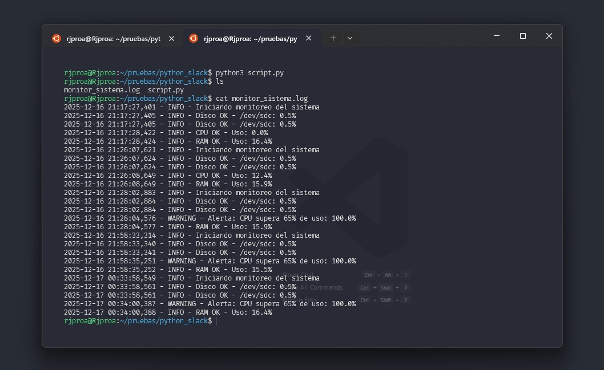
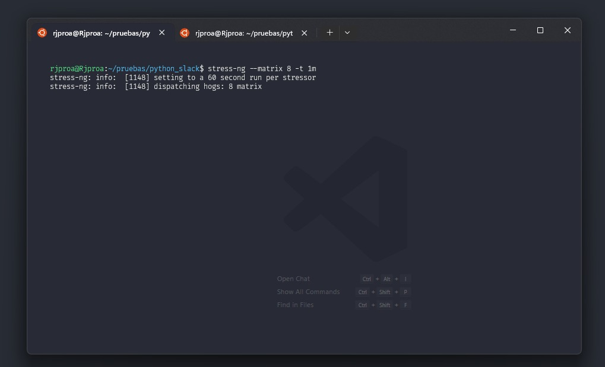
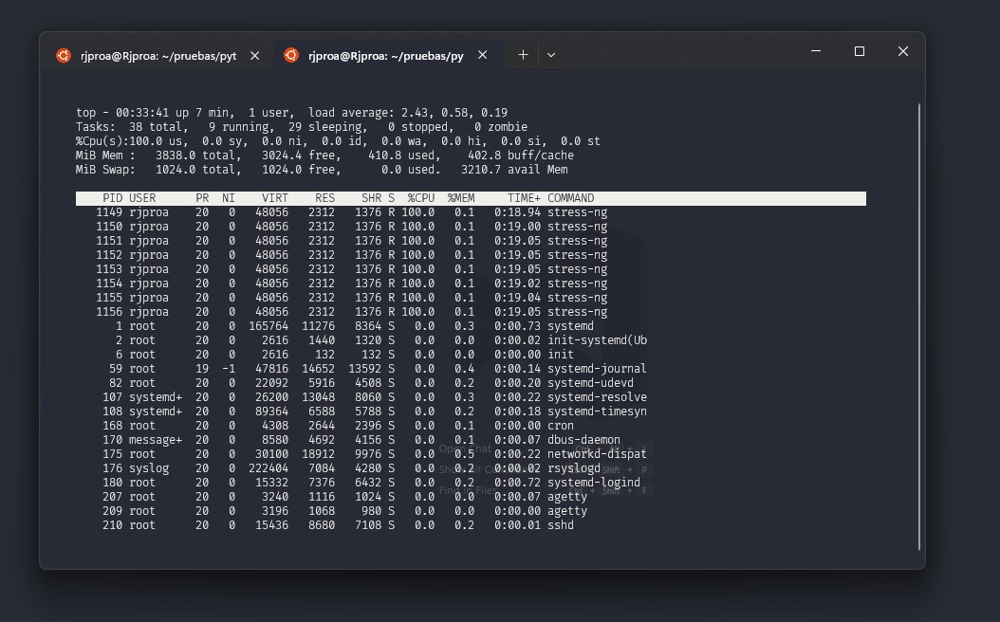
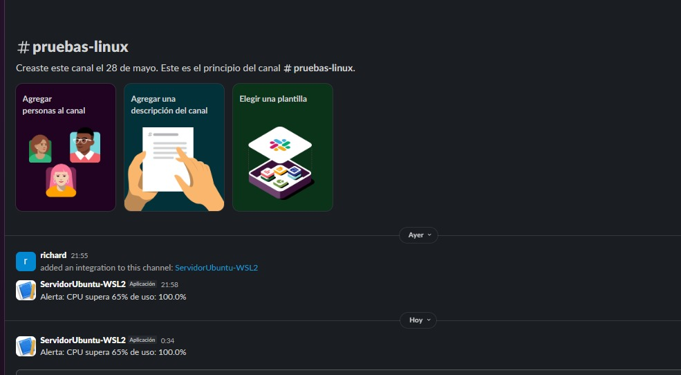

# 📡 Script de Monitoreo del Sistema con Alertas en Slack

Este script monitorea el uso de **disco**, **CPU** y **memoria RAM**, generando un archivo `.log` con los resultados y enviando **alertas a un canal de Slack** si se superan ciertos umbrales críticos.



---

## 🚀 Uso

### ▶️ Pruebas

- Simular sobrecarga de recursos:
```bash
stress-ng --matrix 8 -t 1m
```
> Este comando sobrecarga el consumo de CPU para pruebas



- Verificar estado de recursos con el comando `top`



- Ejecutar script 


- Slack recibe las alertas de sobrecarga



---

### 📌 Requisitos

* Python 3.6+
* Librerías:
  - `psutil`
  - `requests`
  - `python-dotenv`
* Webhook de Slack válido
* Permisos de escritura en la carpeta destino donde se guardarán los logs

> 📦 Instalar dependencias:
```bash
pip install psutil requests python-dotenv
````

---

### ⚙️ Configuración del archivo `.env`

Para enviar alertas a Slack, se requiere configurar un webhook en un archivo `.env` en la raíz del proyecto:

```env
SLACK_WEBHOOK_URL=https://hooks.slack.com/services/tu/webhook/url
```

---

### 📂 Estructura del comando

```bash
python3 script.py --destination /ruta/a/carpeta
```

> El archivo de log `monitor_sistema.log` se generará dentro de la ruta especificada.

* 📁 El parámetro `--destination` es opcional. Por defecto, el archivo log se guardará en el directorio actual.
---

### 📊 Ejemplo visual del resultado

```bash
/home/usuario/monitoring/
└── monitor_sistema.log
```

Contenido del log generado:

```log
2025-06-30 14:56:00,123 - INFO - Iniciando monitoreo del sistema
2025-06-30 14:56:00,456 - INFO - Disco OK - /dev/sda1: 45.2%
2025-06-30 14:56:01,231 - WARNING - Alerta: CPU supera 65% de uso: 82.5%
2025-06-30 14:56:01,874 - INFO - RAM OK - Uso: 48.1%
```

> Las alertas son enviadas al canal de Slack vinculado al webhook configurado en `.env`.

---